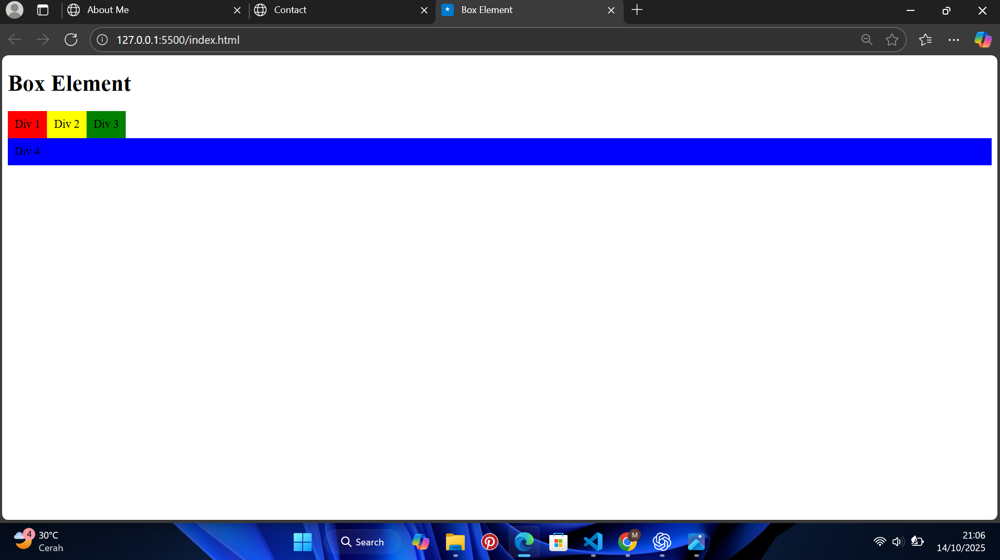
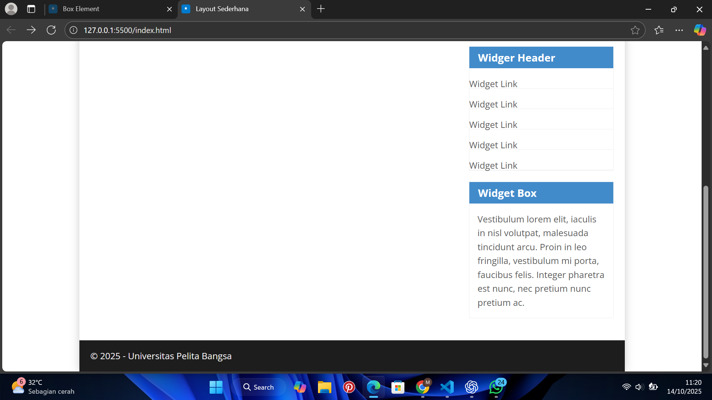

- Nama : Muhamad Nikmal Wahid
- kelas : TI 24 a3
- Pemrograman Web


# Pratikum 4: HTML Layout 

## Intruksi Praktikum 
- Siapkan Text editor seperti VScode
- Buat file baru
- Buat struktur dasar dari dokumen HTML
- Mengikuti langkah-langkah yang tertera
- Lakukan validasi dokumen CSS

# Membuat List
## Langkah-langkah pratikum 
Membuat dokumen HTML seperti berikut: 
```
<!DOCTYPE html>
<html lang="en">
<head>
    <meta charset="UTF-8">
    <meta name="viewport" content="width=device-width, initial-scale=1.0">
    <title>Box Element</title>
</head>
<body>
    <header>
        <h1>Box Element</h1>
    </header>
</body>
</html>
```
## Membuat Box Element
```
<section>
        <div class="div1">Div 1</div>
        <div class="div2">Div 2</div>
        <div class="div3">Div 3</div>
</section>
```

## CSS Float Property
```
<style>
        div {
            float: left;
            padding: 10px;
        }
        .div1 {
            background: red;
        }
        .div2 {
            background: yellow;
        }
        .div3 {
            background: green;
        }
</style>
```


## Mengatur Clearfix Element
```
<section>
        <div class="div1">Div 1</div>
        <div class="div2">Div 2</div>
        <div class="div3">Div 3</div>
        <div class="div4">Div 4</div>
</section>
```
```
.div4 {
            background: blue;
            clear: left;
            float: none;
        }
```


# Membuat Layout Sederhana
## Membuat pratikum
Buat folder baru dengan nama lab4_layout, kemudian membuat file baru dengan nama home.html dan file css dengan nama style.css
```
<!DOCTYPE html>
<html lang="en">
<head>
    <meta charset="UTF-8">
    <meta name="viewport" content="width=device-width, initial-scale=1.0">
    <title>Layout Sederhana</title>
    <link rel="stylesheet" href="style.css">
</head>
<body>
    <div id="container">
    </div>
</body>
</html>
```
Kemudian Tambahkan 
```
<header>
    <h1>Layout Sederhana</h1>
</header>

<nav>
    <a href="home.html" class="active">Home</a>
    <a href="artikel.html">Artikel</a>
    <a href="about.html">About</a>
    <a href="kontak.html">Kontak</a>
</nav>

<section id="hero"></section>

<section id="wrapper">
    <section id="main"></section>
    <aside id="sidebar"></aside>
</section>

<footer>
    <p>&copy; 2021 - Universitas Pelita Bangsa</p>
</footer>
```

Tambahkan CSS
```
@import url('https://fonts.googleapis.com/css2?family=Open+Sans:ital,wght@0,300;0,400;0,600;0,700;0,800;1,300;1,400;1,600;1,700;1,800&display=swap');
@import url('https://fonts.googleapis.com/css2?family=Open+Sans+Condensed:ital,wght@0,300;0,700;1,300&display=swap');

/* CSS */

* {
    margin: 0;
    padding: 0;
}

body {
    line-height: 1;
    font-size: 100%;
    font-family: 'Open Sans', sans-serif;
    color: #5a5a5a;
}

#container {
    width: 980px;
    margin: 0 auto;
    box-shadow: 0 0 1em #cccccc;
}

/* Header */
header {
    padding: 20px;
}
header h1 {
    margin: 20px 10px;
    color: #b5b5b5;
}
```


## Membuat Navigasi
```
nav {
    display: block;
    background-color: #1f5faa;
}

nav a {
    padding: 15px 30px;
    display: inline-block;
    color: #ffffff;
    font-size: 14px;
    text-decoration: none;
    font-weight: bold;
}

nav a.active, 
nav a:hover {
    background-color: #2b83ea;
}

```


## Membuat Hero Panel
```
<section id="hero">
    <h1>Hello World!</h1>
    <p>
        Lorem ipsum dolor sit amet, consectetur adipiscing elit. Vestibulum lorem
        elit, iaculis innisl volutpat, malesuada tincidunt arcu. Proin in leo fringilla,
        vestibulum mi porta, faucibus felis. Integer pharetra est nunc, nec pretium nunc
        pretium ac.
    </p>
    <a href="home.html" class="btn btn-large">Learn more &raquo;</a>
</section>
```
Tambahkan CSS
```
#hero {
    background-color: #e4e4e5;
    padding: 50px 20px;
    margin-bottom: 20px;
}

#hero h1 {
    margin-bottom: 20px;
    font-size: 35px;
}

#hero p {
    margin-bottom: 20px;
    font-size: 18px;
    line-height: 25px;
}
```

## Mengatur layout dan sidebar
```
#wrapper {
    margin: 0;
}

#main {
    float: left;
    width: 640px;
    padding: 20px;
}

/* Sidebar */

#sidebar {
    float: left;
    width: 260px;
    padding: 20px;
}
```


## Membuat sidebar Widget
```
<aside id="sidebar">
    <div class="widget-box">
        <h3 class="title">Widget Header</h3>
        <ul>
            <li><a href="#">Widget Link</a></li>
            <li><a href="#">Widget Link</a></li>
            <li><a href="#">Widget Link</a></li>
            <li><a href="#">Widget Link</a></li>
            <li><a href="#">Widget Link</a></li>
        </ul>
    </div>

    <div class="widget-box">
        <h3 class="title">Widget Text</h3>
        <p>
            Vestibulum lorem elit, iaculis in nisl volutpat, malesuada tincidunt
            arcu. Proin in leo fringilla, vestibulum mi porta, faucibus felis. Integer
            pharetra est nunc, nec pretium nunc pretium ac.
        </p>
    </div>
</aside>
```
Tambah CSS
```
.widget-box {
    border: 1px solid #eee;
    margin-bottom: 20px;
}

.widget-box .title {
    padding: 10px 16px;
    background-color: #428bca;
    color: #fff;
}

.widget-box ul {
    list-style-type: none;
}

.widget-box li {
    border-bottom: 1px solid #eee;
}

.widget-box li a {
    padding: 10px 16px;
    color: #333;
    display: block;
    text-decoration: none;
}
.widget-box li:hover a {
    background-color: #eee;
}

.widget-box p {
    padding: 15px;
    line-height: 25px;
}
```

## Mengatur Footer
```
footer {
    clear: both;
    background-color: #1d1d1d;
    padding: 20px;
    color: #eee;
}
```


## Menambahkan Elemen Lainnya pada main Content
```
<section id="main">
    <div class="row">
        <div class="box">
            
            <h3>Heading</h3>
            <p>
                Donec sed odio dui. Etiam porta sem malesuada magna mollis
                euismod.
            </p>
            <a href="#" class="btn btn-default">View detail</a>
        </div>

        <div class="box">
            
            <h3>Heading</h3>
            <p>
                Donec sed odio dui. Etiam porta sem malesuada magna mollis
                euismod.
            </p>
            <a href="#" class="btn btn-default">View detail</a>
        </div>

        <div class="box">
            
            <h3>Heading</h3>
            <p>
                Donec sed odio dui. Etiam porta sem malesuada magna mollis
                euismod.
            </p>
            <a href="#" class="btn btn-default">View detail</a>
        </div>
    </div>
</section>
```
Tambah CSS
```
.box {
    display: block;
    float: left;
    width: 33.333333%;
    box-sizing: border-box;
    -moz-box-sizing: border-box;
    -webkit-box-sizing: border-box;
    padding: 0 10px;
    text-align: center;
}

.box h3 {
    margin: 15px 0;
}

.box p {
    line-height: 20px;
    font-size: 14px;
    margin-bottom: 15px;
}

box img {
    border: 0;
    vertical-align: middle;
}

.image-circle {
    border-radius: 50%;
}

.row {
    margin: 0 -10px;
    box-sizing: border-box;
    -moz-box-sizing: border-box;
    -webkit-box-sizing: border-box;
}

.row:after, row:before,
.entry:after, .entry:before {
    content: '';
    display: table;
}

.row:after,
.entry:after {
    clear: both;
}
```


## Menambahkan Content Artikel
```
<hr class="divider" />

<article class="entry">
    <h2>First featurette heading.</h2>
    
    <p>
        Lorem ipsum dolor sit amet, consectetur adipiscing elit. Vestibulum lorem
        elit, iaculis in nisl volutpat, malesuada tincidunt arcu. Proin in leo fringilla,
        vestibulum mi porta, faucibus felis. Integer pharetra est nunc, nec pretium nunc
        pretium ac.
    </p>
</article>

<hr class="divider" />

<article class="entry">
    <h2>First featurette heading.</h2>
    
    <p>
        Lorem ipsum dolor sit amet, consectetur adipiscing elit. Vestibulum lorem
        elit, iaculis in nisl volutpat, malesuada tincidunt arcu. Proin in leo fringilla,
        vestibulum mi porta, faucibus felis. Integer pharetra est nunc, nec pretium nunc
        pretium ac.
    </p>
</article>
```
Tambah CSS
```
.divider {
    border: 0;
    border-top: 1px solid #eeeeee;
    margin: 40px 0;
}

.entry {
    margin: 15px 0;
}

.entry h2 {
    margin-bottom: 20px;
}

.entry p {
    line-height: 25px;
}

.entry img {
    float: left;
    border-radius: 5px;
    margin-right: 15px;
}

.entry .right-img {
    float: right;
}

```


# Pertanyaan dan Tugas
## About Html
```
<!DOCTYPE html>
<html lang="en">
<head>
  <meta charset="UTF-8">
  <meta name="viewport" content="width=device-width, initial-scale=1.0">
  <title>About</title>
  <style>
    body {
      font-family: 'Poppins', sans-serif;
      background: #f5f5f7;
      margin: 0;
      color: #333;
    }

    header {
      background: linear-gradient(135deg, #007BFF, #00C6FF);
      color: #fff;
      text-align: center;
      padding: 20px;
      font-size: 1.5em;
    }

    .container {
      max-width: 1000px;
      margin: 50px auto;
      padding: 20px;
    }

    .about {
      background: #fff;
      border-radius: 20px;
      box-shadow: 0 4px 15px rgba(0,0,0,0.1);
      padding: 40px;
    }

    .about h2 {
      text-align: center;
      color: #007BFF;
      margin-bottom: 20px;
    }

    .about p {
      line-height: 1.6;
      text-align: justify;
      margin-bottom: 40px;
    }

    .skills {
      display: grid;
      grid-template-columns: repeat(auto-fit, minmax(250px, 1fr));
      gap: 25px;
    }

    .skill-item {
      background: #f8f8fa;
      border-radius: 15px;
      box-shadow: 0 2px 10px rgba(0,0,0,0.08);
      padding: 25px;
      text-align: center;
      transition: all 0.3s ease;
    }

    .skill-item:hover {
      transform: translateY(-8px);
      background: #e9f3ff;
    }

    .skill-icon {
      font-size: 40px;
      color: #007BFF;
      margin-bottom: 10px;
    }

    .skill-item h4 {
      margin: 10px 0;
      color: #007BFF;
    }

    footer {
      text-align: center;
      padding: 20px;
      color: #777;
      font-size: 0.9em;
    }
  </style>
</head>
<body>

  <header>About Me</header>

  <div class="container">
    <section class="about">
      <h2>Halo Saya Nikmal</h2>
      <p>
      Saya adalah mahasiswa semester 3 jurusan Teknik Informatika dari Universitas Pelita Bangsa.
      Saya memiliki minat besar dalam dunia teknologi, khususnya dalam pengembangan web dan desain antarmuka.
      Berikut beberapa keahlian dan layanan yang saya tawarkan:
      </p>

      <div class="skills">
        <div class="skill-item">
          <div class="skill-icon"></div>
          <h4>Web Development</h4>
          <p>Lorem ipsum dolor sit amet consectetur adipisicing elit. Quae eos totam veniam saepe nostrum recusandae blanditiis. Officia doloremque laudantium ipsa eos, quia quibusdam animi perferendis, facilis ut magni iste non!.</p>
        </div>

        <div class="skill-item">
          <div class="skill-icon"></div>
          <h4>UI/UX Design</h4>
          <p>Lorem ipsum dolor sit, amet consectetur adipisicing elit. Facilis mollitia placeat, soluta consectetur velit doloremque reprehenderit suscipit et aut natus facere dolorem a quidem quo est repudiandae ducimus ut ipsum!</p>
        </div>

        <div class="skill-item">
          <div class="skill-icon"></div>
          <h4>Front-End Frameworks</h4>
          <p>Lorem, ipsum dolor sit amet consectetur adipisicing elit. Aperiam, id deserunt. Velit placeat, accusantium dolorem numquam sint ipsa eum aut cupiditate harum fuga in. Sunt optio rem excepturi tempora         necessitatibus..</p>
        </div>

        <div class="skill-item">
          <div class="skill-icon"></div>
          <h4>Responsive Design</h4>
          <p>Lorem ipsum dolor sit amet consectetur adipisicing elit. Incidunt nam, laborum ad a explicabo magnam reprehenderit vero facilis sequi, dignissimos illum quidem quam voluptates expedita dolor non. Quisquam, autem quae.</p>
        </div>

        <div class="skill-item">
          <div class="skill-icon"></div>
          <h4>Hosting & Deployment</h4>
          <p>Lorem ipsum dolor sit amet consectetur adipisicing elit. Rem id reiciendis, quidem eum provident magnam tempore voluptate similique assumenda placeat numquam, magni neque corrupti. Nemo dicta provident architecto magnam expedita?.</p>
        </div>

        <div class="skill-item">
          <div class="skill-icon"></div>
          <h4>Performance Optimization</h4>
          <p>Lorem ipsum dolor sit amet consectetur, adipisicing elit. Officiis aut facere inventore omnis libero veritatis ipsum nemo quasi dicta aperiam, ullam temporibus exercitationem tenetur quo culpa alias facilis, molestias adipisci..</p>
        </div>
      </div>
    </section>
  </div>

  <footer>&copy; 2025 Cyozenn. All rights reserved.</footer>

</body>
</html>

```

## Kontak HTML
```
<!DOCTYPE html>
<html lang="en">
<head>
  <meta charset="UTF-8">
  <meta name="viewport" content="width=device-width, initial-scale=1.0">
  <title>Contact</title>
  <style>
    body {
      font-family: 'Poppins', sans-serif;
      background: #f5f5f7;
      margin: 0;
      color: #333;
    }

    header {
      background: linear-gradient(135deg, #007BFF, #00C6FF);
      color: #fff;
      text-align: center;
      padding: 20px;
      font-size: 1.5em;
    }

    .container {
      max-width: 600px;
      margin: 50px auto;
      padding: 20px;
    }

    .contact {
      background: #fff;
      border-radius: 20px;
      box-shadow: 0 4px 15px rgba(0,0,0,0.1);
      padding: 40px;
    }

    .contact h2 {
      text-align: center;
      color: #007BFF;
      margin-bottom: 20px;
    }

    form {
      display: flex;
      flex-direction: column;
      gap: 15px;
    }

    input, textarea {
      padding: 12px 15px;
      border: 1px solid #ccc;
      border-radius: 10px;
      font-size: 1em;
      outline: none;
      transition: border-color 0.2s;
    }

    input:focus, textarea:focus {
      border-color: #007BFF;
    }

    button {
      background: linear-gradient(135deg, #007BFF, #00C6FF);
      color: #fff;
      border: none;
      padding: 12px;
      border-radius: 10px;
      font-size: 1em;
      cursor: pointer;
      transition: 0.3s;
    }

    button:hover {
      opacity: 0.9;
    }

    footer {
      text-align: center;
      padding: 20px;
      color: #777;
      font-size: 0.9em;
    }
  </style>
</head>
<body>

  <header>Contact Me</header>

  <div class="container">
    <section class="contact">
      <h2>Send a Message</h2>
      <form>
        <input type="text" placeholder="Nama Lengkap" required>
        <input type="email" placeholder="Email" required>
        <textarea rows="5" placeholder="Pesan kamu..." required></textarea>
        <button type="submit">Kirim Pesan</button>
      </form>
    </section>
  </div>

  <footer>&copy; 2025 Cyozenn. All rights reserved.</footer>

</body>
</html>

```


